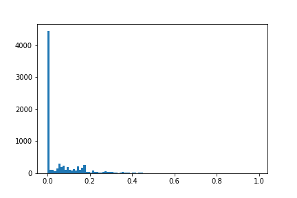
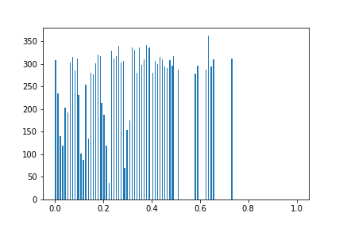
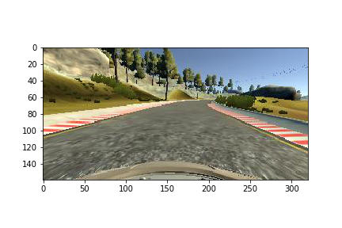
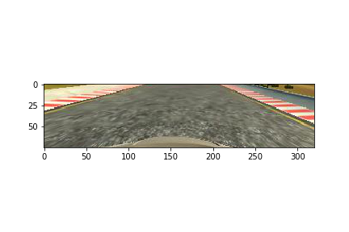
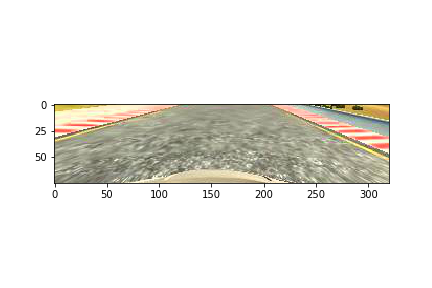
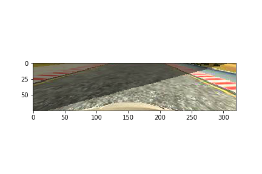
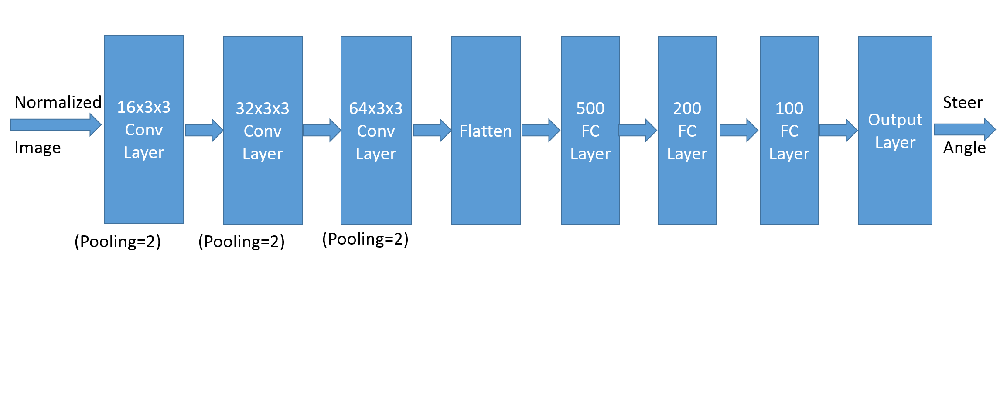

**Behavioral Cloning Project**

The goals / steps of this project are the following:
* Use the simulator to collect data of good driving behavior
* Build, a convolution neural network in Keras that predicts steering angles from images
* Train and validate the model with a training and validation set
* Test that the model successfully drives around track one without leaving the road
* Summarize the results with a written report

**Project Review:**

Thoughts about the project:
* This is one of the most interesting, challenging and fulfilling projects I have worked on. Especially tuning of the model, preprocessing of data were key takeaways. I wanted to spend some time after this project to code other approaches followed other awesome Udacity Students.

<b> Follow Up Actions when I have time after the semester: </b>
* Use transfer learning of VGG, add layer at the end to use for this project
* Tuning the model with recovery data
* Visualization of layers for getting intuition about the image filters
* Use ResNet Model for the project

<b>Files Submitted & Code Quality</b>

The project here includes all required files and can be used to run the simulator in autonomous mode

My project source code includes the following files:
* model2.py containing the script to create and train the model
* drive.py for driving the car in autonomous mode
* model.h5 contains a trained convolution neural network 
* writeup_report.md or writeup_report.pdf summarizing the results

<b> Results: </b>
* Track1.mp4 demonstrates video of the car running in autonomous mode around Track 1 (this is the track used for training)
* Track2.mp4 demonstrates video of the same car's performance on a little difficult track (Track 2) which has steep turns and dark alleys
Summary: The model performs well on both tracks

<b> How to run the code: </b>
* Using the Udacity provided simulator and drive.py file in my source code path, the car can be driven autonomously around the track by executing "python drive.py model.h5"
* Recording of the car's performance can be obtained using "python video.py model.h5"


[image1]: ./files/cropped_image.png "Model Visualization"
[image2]: ./files/uncropped_image.png "Grayscaling"

<b> Model Architecture and Training Strategy </b>

<b> 1. An appropriate model arcthiecture has been employed </b>

My model consists of a convolution neural network with 3x3 filter sizes and depths with 16,32 and 64 (model.py lines 37-49), followed by fully connected layers of sizes of 500 and 200 (lines 52-60)

The model includes RELU layers to introduce nonlinearity , and the data is normalized in the model using a Keras lambda layer (code line 38). 

<b> 2. Attempts to reduce overfitting in the model</b>

I added dropout layers in the beginning and turns out that it affected performance, so ended up not using them.
I found out with dropouts the car wasn't able to steer sharp turns with model used, as I peeled off dropout the model was able to take sharp turns and pass the tracks. I could have increased the size of model but removing dropouts worked effectively.

The model was trained and validated on different data sets to ensure that the model was not overfitting (code line 20,73). The model was tested by running it through the simulator and ensuring that the vehicle could stay on the track.

<b> 3. Model parameter tuning </b>

The model used an adam optimizer, so the learning rate was not tuned manually (model.py line 62). However, the choice of learning rate turned out to be important. Initially, I had training rate of 0.01 but the validation loss was fluctuating lot so I reduced the training rate to 0.0001

<b> 4. Appropriate training data </b>

Training data was chosen to keep the vehicle driving on the road. I have used the data provided by Udacity for tuning the data. I really wanted to see if I can get the car running without collecting recovery data as we might have the luxury recollecting data using real-car. I was able to get the model working with Udacity however it required heavy usage of data augumentation techniques. I will describe in detail below, the data augumentation techniques I have used. 

For details about how I created the training data, see the next section. 

<b> Model Architecture and Training Strategy </b>

<b> 1. Solution Design Approach </b>

The overall strategy for deriving a model architecture was to use 
* simple single fully connected layer to get the simulator, code up and running
* I then used a model similar to the one used by nVIDIA
* Then I add pre-processing and data augumentation to overcome the issues such as steering to left, right and not steering enough
* Then I went iterated between increasing of model parameters, data augumentation to fine tune model

My first step was to use a convolution neural network model similar to the nVIDIA model. I thought this model might be appropriate because nVIDIA was able to get an end-to-end driving system using the model.

In order to gauge how well the model was working, I split my image and steering angle data into a training and validation set. I found that my first model had a low mean squared error on the training set but a high mean squared error on the validation set. This implied that the model was overfitting. To combat the overfitting, I modified the model I added dropout. I tried many techniques to tune the model, I will list some of the techniques which lead me to follow the path rather than all iterations.

<b> Step 1: Data Augumentation by flipping images </b>

I found that the car initially had bias towards left side, this was probably because most of the track was towards left. So, I flipped the images using OpenCV and negated steering angle (lines 122-14 of data_gen.py)

<b> Step 2: Data Augumentation by using left and center cameras </b>

I found that the car now started bias towards right side some times. I used left and right cameras to augument more data so that it can chose between left and right appropriately (lines 101-109 of data_gen.py). I used offset of +/-0.25 as steering offset for left and right images respectively


<b> Step 3: Creating equal amount of images for all steering angles </b>
After this, I found can moving along some distance nicely, but it was going too smoothly and had issues with turns.
So, I  created equal amount of data points for all steering angles with data augumentation. This lead to car able to get till the bridge but it was going into open space after the bridge

| Histogram of absolute steering angles in raw data|Histogram of absolute steering angles (augumenting images for steering angles with less amount of data)|
|---|---|
|  |  |


<b> Step 4: More cropping </b>
After much frustration, I found that by cropping more than initial amount, I was able to get the car steer steeper.
After this and some tuning, the car was able to cross the bridge but was always going to open muddy road after the bridge. I spent lot of time tuning for this. I think this helped because without proper cropping, the model was picking irrelevant features such as trees in it's decision. By cropping the image more, I was able to tune the model to focus only the road & it's features.

| Uncropped Image|Cropped Image|
|---|---|
|  |  |

<b> Step 4: Brightness augumentation </b>

I added brightness augumentation as a random technique to see if it helps. It didn't help much.After plotting predicted steering angles and expected angles, I started wondering if I was regularizing model too much.

| Cropped Image |Cropped Image with Brightness Augumentation|
|---|---|
|  |  |


<b> Step 4: Reducing Dropout </b>

Now, I started playing by increasing and decreased dropout ratio, adding/removing dropout from multiple layers.
I found that as I started reducing dropout, model was steering at sharp turns better. I started peeling off dropout and found that it was steering the sharp turns. At this point, I realized my model was not complex to have dropout probably

<b> Step 5: Augumenting images with shadows </b>

At this point I found that the car was able to drive Track 1 well but was getting stopped out half way in Track 2.
I found that brightness augumentation which I added might not be sufficient. After brainstorming with fellow Udacity students, they pointed me to shadow augumentation (lines 144-153 of data_gen.py)
To my surprise, I was able to complete Track2

| Before adding Shadow|After adding Shadow|
|---|---|
|  |  |

<b> Step 6: Initializing Layers </b>

I found that the car was working well on Track 1, however it was failing Track 2 occassionally. I played with different initialization and found either glorot_ubiform  or he_relu worked well.

At the end of the process, the vehicle is able to drive autonomously around the track 1 without leaving the road.
However, the model might still need some fine tuning to run reliably on track 2. It runs reliably on track 1.

**2. Final Model Architecture**

The final model architecture (model.py lines 18-24) consisted of a convolution neural network with the following layers and layer sizes ...

Here is a visualization of the architecture (note: visualizing the architecture is optional according to the project rubric)



**3. Creation of the Training Set & Training Process**

I used data provided by Udacity for this project. I employed many data augumentation techniques
1) Flipping of images and ngeating steering angles (2x the data)
2) Using Left and Right Cameras and offsetting steering angles (2x data)
3) Brightness Augumentation
4) Random Vertical Shift
5) Adding Shadows

I used Adam Optimizer with a learning rate = 1e-04 and mean squared error as a loss function. I used 20% of the training data for validation and the model seems to perform quite well after training for 10 epochs.


**4. Result:**

The car drives on Track 1 without any interruptions. However, on Track2 current compile model doesn't finish Track2. However when model2.py is recompiled, sometimes the model generated seems to finish the track 2.
Here is video of car working on Track 1 and Track 2:

Track1 Drive [video compilation](https://www.youtube.com/watch?v=7Pnnr5gi7ks)

Track2 Drive [video compilation](https://www.youtube.com/watch?v=4nHSb-Iuny0)

Here is video of car working on Track 1 and not Track 2 with better video quality:

Track1 Drive [video compilation](https://www.youtube.com/watch?v=Xi1hANVMy5k) 

Track2 Drive [video compilation](https://www.youtube.com/watch?v=Oz6UY5tCFl8)


Overall, the model always works on Track1.


```python

```
